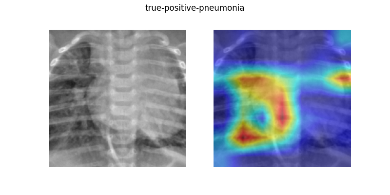

# Pneumonia Detection with Grad-Cam Heatmaps for Explainability

This repo explores the problem of classifiying chest X-ray scans to one of two classes pneumonia/normal. The dataset used is [Chest X-Ray Images (Pneumonia)](https://www.kaggle.com/datasets/paultimothymooney/chest-xray-pneumonia). The best result is obtained using transfer learning with a custom classification head on `resnet50`.

See a demo on on [Hugging Face Spaces](https://huggingface.co/spaces/yzhng172/pneumonia-detection-with-grad-cam)



---

## Main Features

- **Experiment tracking** with [MLflow](https://mlflow.org/)
- **Explainability** with Grad-Cam heatmaps using [pytorch-gram-cam](https://github.com/jacobgil/pytorch-grad-cam)
- **FastAPI service** that returns predicted label and Grad-CAM heatmap
- **Dockerized** for local reproducibility
- **Deployed demo** on [Hugging Face Spaces](https://huggingface.co/spaces)

---

## Best Result

The best result is obtained using transfer learning with a custom classification head on `resnet50`. [See model architecture](model/Resnet50Model2.py).

```
{
  "accuracy": 0.90,
  "precision": 0.89,
  "recall": 0.96,
  "f1": 0.92
}
```

## Usage

Run train script

```bash
python train.py --save_base_folder=trained/ \
 --epochs=10 \
 --batch_size=32 \
 --save_epochs=1
```

Run test script

```bash
python test.py --model_path=trained/Resnet50Model2-adam-0.0001-64-20-augment/epoch_19/model.pth \
--model_name=Resnet50Model2-adam-0.0001-64-20-augment \
--batch_size=32 \
--save_folder=test_results \
--enable_grad_cam=True
```

Run experiment with MLflow UI

```bash
mlflow ui

python -m experiments.run_experiment  --config_path=experiments/configs/Resnet50Model2-adam-1e4-64.yaml
```

Run API locally

```bash
uvicorn api.api:app --host 0.0.0.0 --port 8000
```

Open http://localhost:8000/docs for Swagger UI.

Docker

```bash
docker build -t pneumonia-api .
docker run -p 8000:8000 pneumonia-api
```
